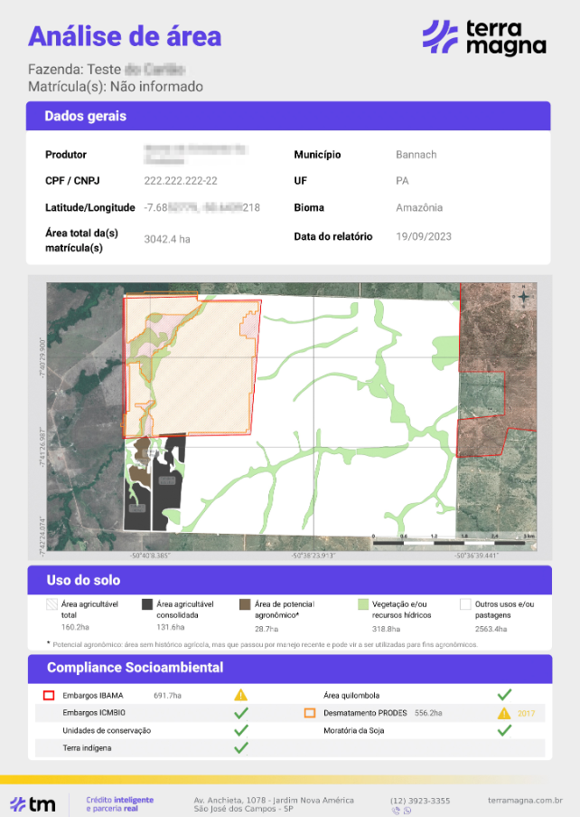
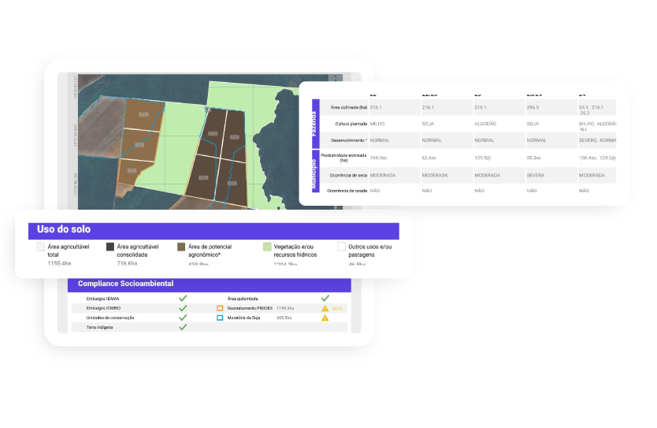
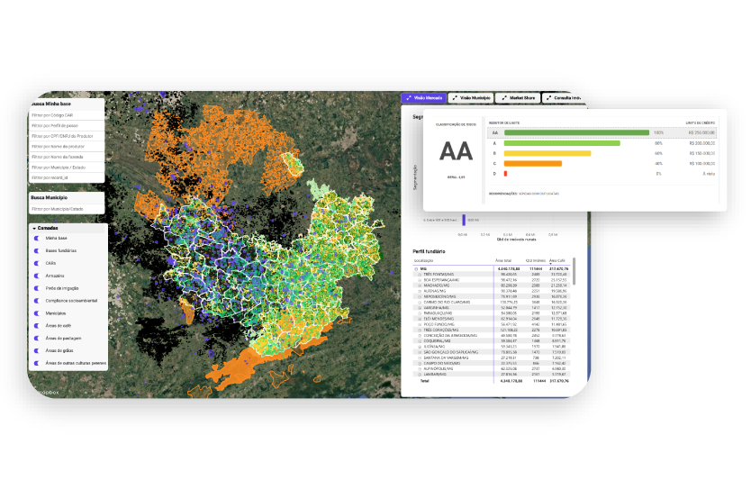
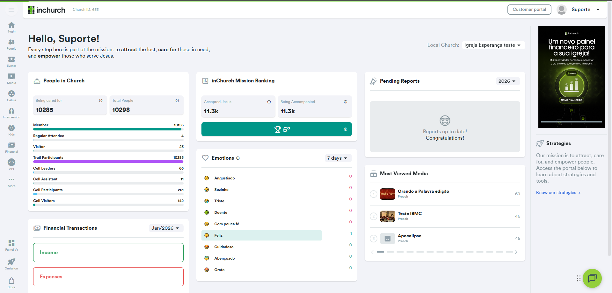
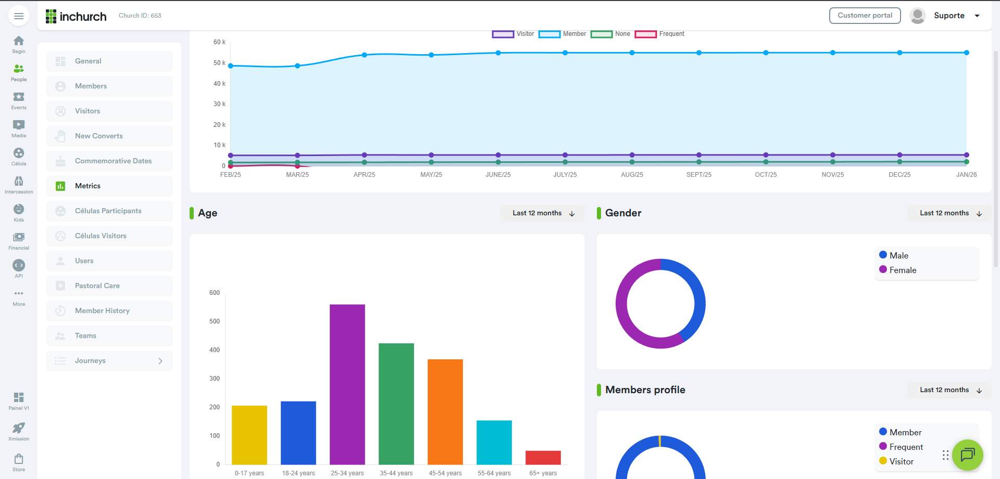
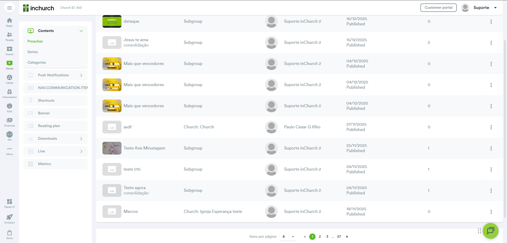
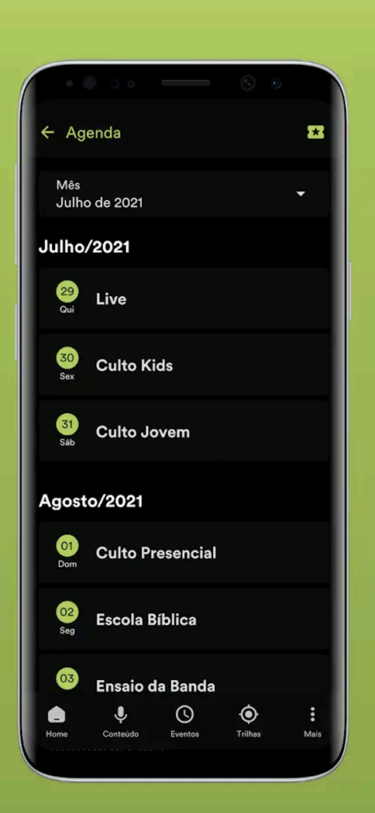

# Yan Pessoa da Silva Correia  
## Senior Software Engineer | Frontend, Backend & Mobile

📍 Rio de Janeiro, Brazil  
📧 yanpessoa000@gmail.com  
🔗 https://www.linkedin.com/in/yan-pessoa-1421b972/

---

# Portfolio

This portfolio presents **three production-grade projects** where I worked as a **Senior / Tech Lead engineer**, delivering **web platforms, APIs, data-heavy dashboards, and mobile applications** used at scale.

---

## Project 01 — TM Digital (TerraMagna)

### Geospatial Credit Intelligence Platform  
**Angular · NgRx · Mapbox · NestJS · PostgreSQL**

#### Key Screens

**Overview**  
Geospatial intelligence platform supporting agricultural credit risk analysis using satellite imagery, land-use classification, and compliance data.

**Impact**
- APIs used by **100+ client organizations**
- **20k+ credit analyses/day**
- Core platform responsible for **~70% of company revenue**

---

## Project 02 — InChurch (Web Platform)

### Church Management & Analytics Dashboard  
**Angular · Chart.js · PrimeNG · TailwindCSS · Node.js · NestJS**

#### Key Screens

**Overview**  
Administrative and analytics platform enabling churches to manage engagement, finances, and operations using data-driven dashboards.

**Impact**
- **100k+ users**
- **35% sales increase**
- **40% donation growth**

---

## Project 03 — InChurch Control App (Mobile)

### Mobile Application for Church Engagement  
**React Native · Node.js · NestJS**

#### Key Screens

**Overview**  
Mobile-first app serving as the primary engagement channel between churches and members, featuring content, events, live streams, and spiritual journeys.

**Impact**
- Tens of thousands of daily active users
- Main engagement touchpoint for churches
